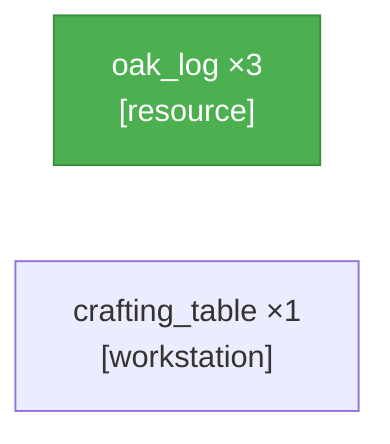

# PTD Self\-Refine — demo live objective

## Round 0 · Generate

**Latency:** 0 ms

---

## Round 0 · Validate

**Latency:** 0 ms

**Verdict:** ❌ fail

**Definite issues:**
- Missing crafting table workstation node

**Summary:** Need an explicit workstation vertex\.

---

## Round 1 · Refine

**Latency:** 0 ms

---

## Round 1 · Validate

**Latency:** 0 ms

**Verdict:** ✅ pass

**Summary:** Looks good\.

---
