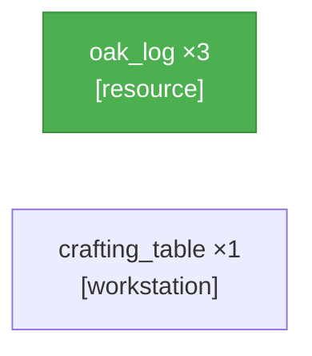

<table width="100%" style="table-layout: fixed; border-collapse: separate; border-spacing: 0;"><tr>
<td width="72%" valign="top" style="border: 1px solid #d0d7de; border-radius: 14px; padding: 18px 16px; box-sizing: border-box;">

# PTD — demo live objective

**LLM latency**
- **PTD generation:** 0 ms



</td>
<td width="2%"></td>
<td width="26%" valign="top" style="border: 1px solid #d0d7de; border-radius: 14px; padding: 18px 16px; box-sizing: border-box;">

<div align="center" style="height: 100%; display: flex; flex-direction: column; justify-content: center;">
<div style="font-size: 0.85em; font-weight: 700; letter-spacing: 0.08em; text-transform: uppercase; opacity: 0.8; margin-bottom: 0.6em;">Elapsed</div>
<div style="font-size: 3.4em; font-weight: 800; line-height: 1; margin: 0 0 0.3em 0; white-space: nowrap;">0s</div>
<div style="font-size: 0.95em; font-weight: 600;">Completed</div>
</div>

</td>
</tr></table>

---

<table width="100%" style="table-layout: fixed; border-collapse: separate; border-spacing: 0;"><tr>
<td width="50%" valign="top" style="border: 1px solid #d0d7de; border-radius: 14px; padding: 18px 16px; box-sizing: border-box;">

# Completed — demo live objective

**Task complete.**

- **Reason:** demo completed
- **Total elapsed:** 0s


</td>
<td width="2%"></td>
<td width="50%" valign="top" style="border: 1px solid #d0d7de; border-radius: 14px; padding: 18px 16px; box-sizing: border-box;">

_Candidates not yet computed._

</td>
</tr></table>

---

<table width="100%" style="table-layout: fixed; border-collapse: separate; border-spacing: 0;"><tr>
<td width="50%" valign="top" style="border: 1px solid #d0d7de; border-radius: 14px; padding: 18px 16px; box-sizing: border-box;">

**Current Task**

```json
{
  "target_item": "oak_log",
  "qty": 3,
  "action_type": "collect",
  "parameters": {
    "source_block": "oak_log"
  }
}
```

</td>
<td width="2%"></td>
<td width="50%" valign="top" style="border: 1px solid #d0d7de; border-radius: 14px; padding: 18px 16px; box-sizing: border-box;">

**Current Action** _(attempt 1)_

```
!collectBlocks("oak_log", 3)
```

</td>
</tr></table>