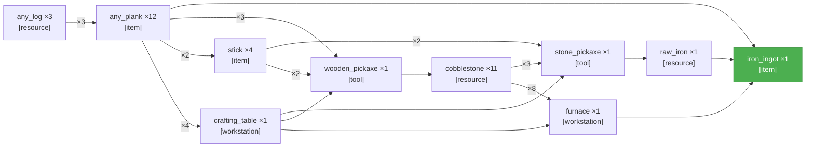

# SCSG — test
_r=1_

```mermaid
graph LR
    iron_ingot["iron_ingot ×1<br/>[item]"]
    raw_iron["raw_iron ×1<br/>[resource]"]
    furnace["furnace ×1<br/>[workstation]"]
    any_plank["any_plank ×12<br/>[item]"]
    any_log["any_log ×3<br/>[resource]"]
    stone_pickaxe["stone_pickaxe ×1<br/>[tool]"]
    wooden_pickaxe["wooden_pickaxe ×1<br/>[tool]"]
    stick["stick ×4<br/>[item]"]
    crafting_table["crafting_table ×1<br/>[workstation]"]
    cobblestone["cobblestone ×11<br/>[resource]"]
    raw_iron -->iron_ingot
    any_plank -->iron_ingot
    furnace -->iron_ingot
    stone_pickaxe -->raw_iron
    stick -->|"×2"| stone_pickaxe
    cobblestone -->|"×3"| stone_pickaxe
    crafting_table -->stone_pickaxe
    wooden_pickaxe -->cobblestone
    stick -->|"×2"| wooden_pickaxe
    any_plank -->|"×3"| wooden_pickaxe
    crafting_table -->wooden_pickaxe
    cobblestone -->|"×8"| furnace
    crafting_table -->furnace
    any_plank -->|"×2"| stick
    any_plank -->|"×4"| crafting_table
    any_log -->|"×3"| any_plank
    style iron_ingot fill:#4CAF50,color:#fff,stroke:#388E3C
```